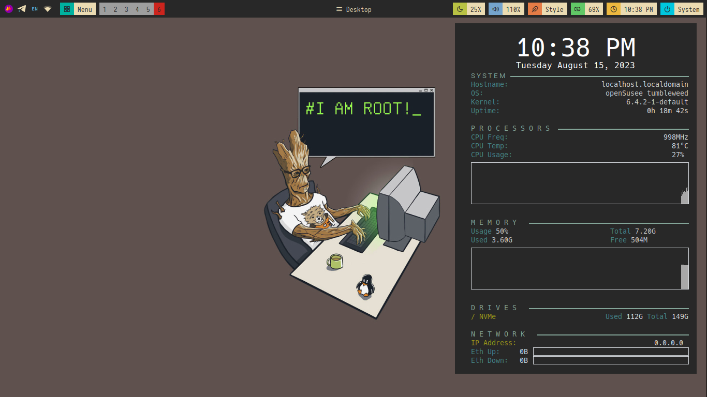
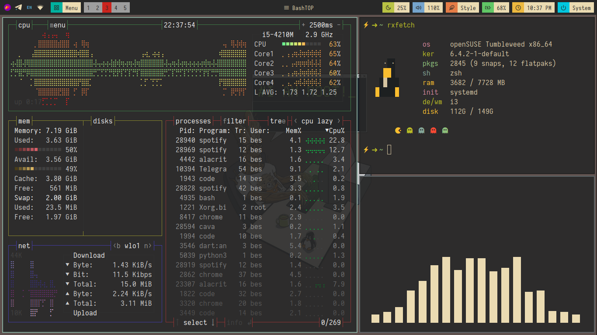

# dotfiles

Dotfiles for my `opensuse` + `i3WM` setup.

## Tools used

- Window Manager - [i3WM](https://i3wm.org/)
- Terminal - [Alacritty](https://github.com/alacritty/alacritty)
- Shell - [zsh](https://github.com/ohmyzsh/ohmyzsh/wiki/Installing-ZSH)
- Bar - [Polybar](https://github.com/polybar/polybar)
- File manager - [Thunar](https://docs.xfce.org/xfce/thunar/start)
- Audio visualizer - [Cava](https://github.com/karlstav/cava)
- Wallpaper - [Gruvbox-walls](https://imgur.com/a/D0rXp8m)
- Wallpaper manager - [Nitrogen](https://wiki.archlinux.org/title/nitrogen)
- PDF reader - [Zathura](https://pwmt.org/projects/zathura/)
- Text editor - [Nvim](https://neovim.io/)

## Installation 

I am currently working on installation script that automates everything but for the time being install all programs listed above and follow steps listed below:-

```shell
   # Create folder to store previous dotfiles 
   mkdir .config-backup
   
   # Backup your dotfiles
   rsync -ah ~/.config ~/.config-backup --progress
  
   # Clonning my repo
   git clone https://github.com/Besufikad17/fedora-dotfiles.git

   # Copy all my dotfiles 
   rsync -a dotfiles ~/.config
```

## Preview



