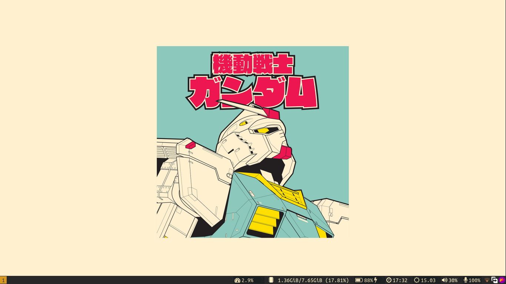
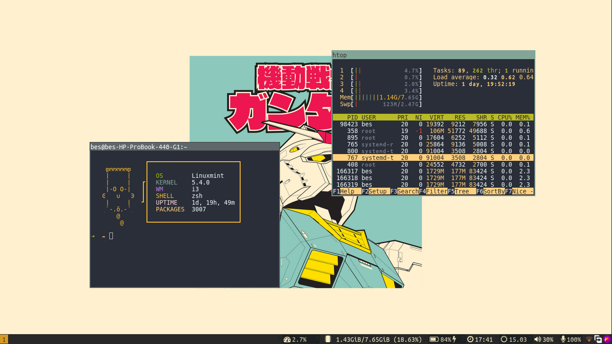

# Dotfiles

- Window Manager - [i3WM](https://i3wm.org/)
- Terminal - [Kitty](https://sw.kovidgoyal.net/kitty/)
- Shell - [zsh](https://github.com/ohmyzsh/ohmyzsh/wiki/Installing-ZSH)
- Bar - [Bumblebee-status](https://github.com/tobi-wan-kenobi/bumblebee-status)
- Wallpaper - [Gruvbox-walls](https://imgur.com/a/D0rXp8m)
- Wallpaper manager - [Nitrogen](https://wiki.archlinux.org/title/nitrogen)

## Installation 

I am currently working on installation script that automates everything but for the time being install all programs listed above and follow steps listed below:-

```shell
   # Create folder to store previous dotfiles 
   mkdir .config-backup
   
   # Backup your dotfiles
   rsync -a ~/.config ~/.config-backup
  
   # Clonning my repo
   git clone https://github.com/Besufikad17/dotfiles.git

   # Copy all my dotfiles 
   rsync -a dotfiles ~/.config
```

## Preview




